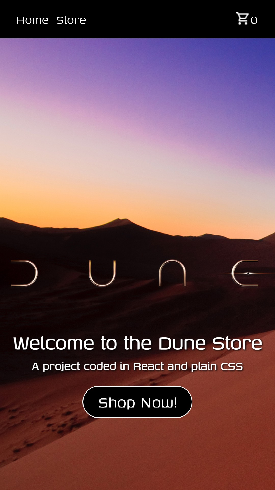
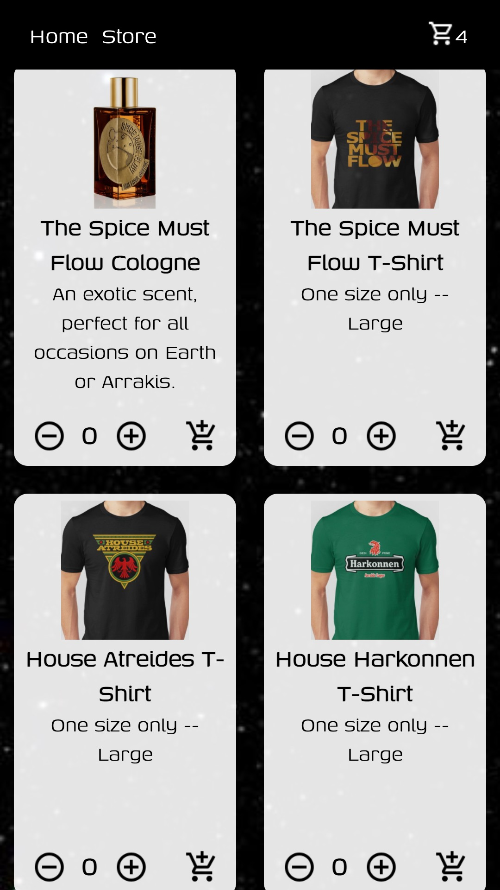
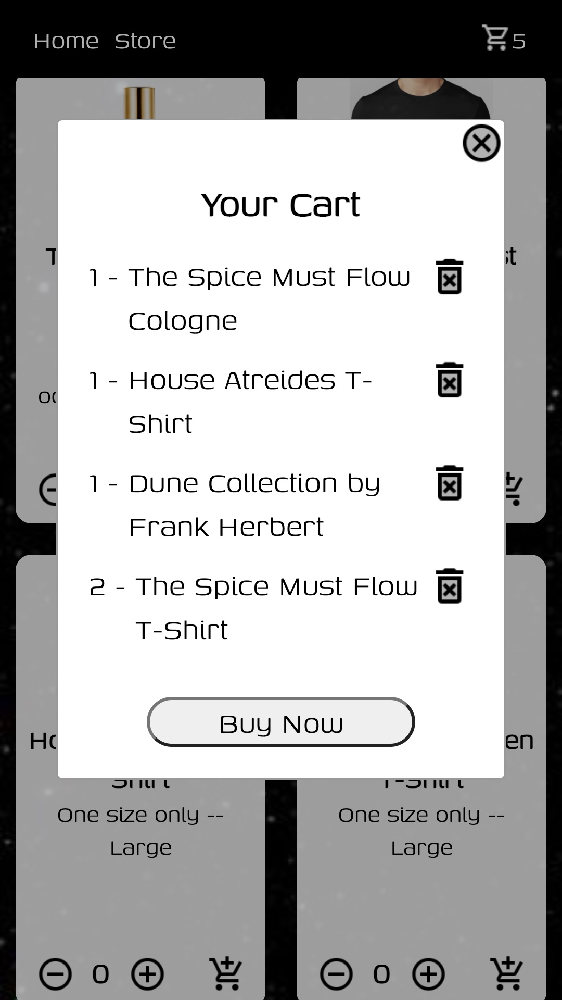

# 🛒 Shopping Cart web app

*A shopping cart app written in React and plain CSS*

Date completed:  November 23, 2021  

**Optimized for 📱 mobile and 🖥 desktop!**  

**See it live at (https://rusty-reebs.github.io/shopping-cart/)!**  

Objectives: practice using `react-router-dom` to build a multi-page web app utilizing React functional components, hooks, and state.

### Screenshots
-----

&nbsp;&nbsp;&nbsp;&nbsp;&nbsp;&nbsp;  

### TIL Things I Learned
-----

- how to use routes to navigate between pages
- practiced using array methods like `.find`, `.filter`, and `.map`
- how to build and call a modal in React
- practiced passing `state` and `props` to different components
- how to import images in React
- practiced responsive design in plain CSS
